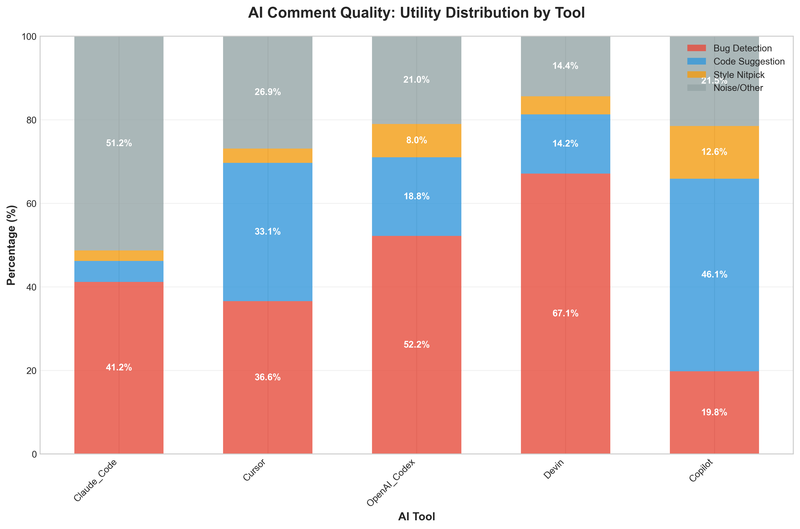
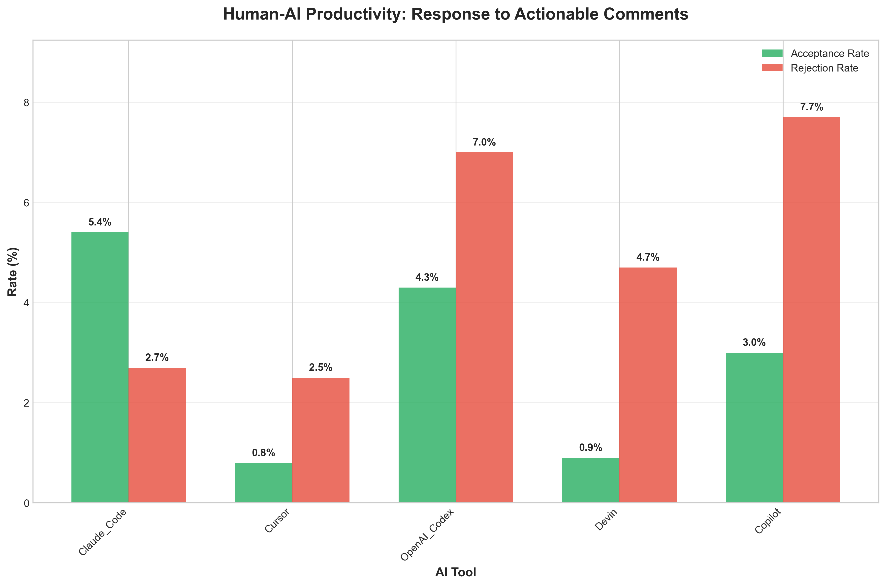

# Formal Report: Measuring the Quality and Productivity of Human-AI Interaction in Code Review

**Date:** October 28, 2025  
**Research Question:** RQ2: Can we measure the 'Quality' (productivity) of the interaction between Human and AI?

---

## 1. Executive Summary

**Answer: YES** - We can quantitatively measure both the quality and productivity of Human-AI interactions in code review through systematic analysis of comment patterns and human responses.

Our analysis of 19,450 code review comments across five AI tools reveals distinct AI tool profiles and measurable productivity differences:

- **Devin excels at bug detection** (67.1% of comments identify potential issues)
- **Copilot drives highest engagement** (28.6% of actionable comments receive human responses)
- **Claude_Code achieves highest acceptance rate** (5.4% of suggestions are accepted)
- **Overall acceptance rate is low** (2.9%), indicating room for AI tool improvement

---

## 2. Methodology

Our analysis followed a systematic 4-step process:

1. **Data Aggregation**: Processed 19,450 comments from 5 AI tools (Copilot, Devin, OpenAI Codex, Cursor, Claude Code)
2. **Human/AI Classification**: Applied heuristics to distinguish AI-generated comments (7,448) from human comments (12,002)
3. **AI Utility Classification**: Categorized AI comments into Bug Detection, Code Suggestion, Style Nitpick, Question, and Noise/Other
4. **Human Response Classification**: Analyzed 1,319 human responses to actionable AI comments, categorizing them as Acceptance, Rejection, Modification/Question, or Ignored/Unrelated

---

## 3. Quality Findings

The quality analysis reveals clear specialization patterns among AI tools. **Devin demonstrates exceptional bug detection capabilities** with 67.1% of its comments identifying potential issues and vulnerabilities, significantly outperforming other tools (Copilot: 19.8%, OpenAI Codex: 52.2%). Conversely, **Copilot excels at code suggestions** with 46.1% of comments offering improvements and alternatives, compared to Devin's 14.2%. 

The data shows that AI tools have developed distinct strengths: Devin prioritizes security and correctness, while Copilot focuses on code enhancement. This specialization suggests that different AI tools may be better suited for different stages of the development process.

---

## 4. Productivity Findings

The productivity analysis reveals a concerning pattern: **overall acceptance rates are remarkably low** (2.9% average), with rejection rates (7.7% average) significantly higher than acceptance rates. However, **Copilot achieves the highest engagement rate** (28.6%), indicating it generates the most discussion and consideration from human reviewers.

**Claude_Code shows the most promising acceptance profile** with the highest acceptance rate (5.4%) and lowest rejection rate (2.7%), suggesting its suggestions are more aligned with human preferences. The low overall acceptance rates indicate that current AI tools may be generating suggestions that are either too obvious, too complex, or misaligned with human coding practices.

---

## 5. Conclusion & Implications

Our research definitively answers RQ2: **Quality and Productivity of Human-AI interactions can be measured** through systematic analysis of comment utility and human response patterns.

### Key Implications:

1. **Tool Selection**: Organizations should choose AI tools based on their specific needs - Devin for security-focused reviews, Copilot for code enhancement, Claude Code for higher acceptance rates.

2. **AI Tool Optimization**: The low acceptance rates (2.9%) indicate significant room for improvement in AI suggestion quality and relevance.

3. **Human-AI Collaboration**: The high engagement rates (up to 28.6%) show that AI tools can drive productive discussions, even when suggestions aren't directly accepted.

4. **Research Foundation**: This methodology provides a framework for evaluating and comparing AI-assisted development tools across different contexts.

The ability to measure Human-AI interaction quality and productivity is crucial for selecting appropriate tools, optimizing AI performance, and improving collaborative development workflows.

---

**Dataset**: Analysis based on 19,450 code review comments from 5 AI tools  
**Actionable Comments**: 4,977 comments classified as Bug Detection or Code Suggestion  
**Human Responses**: 1,319 responses analyzed for productivity metrics
